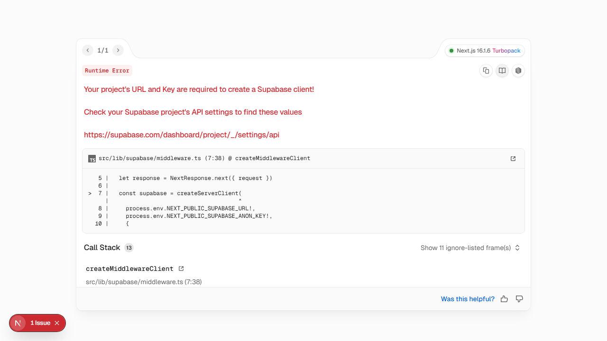
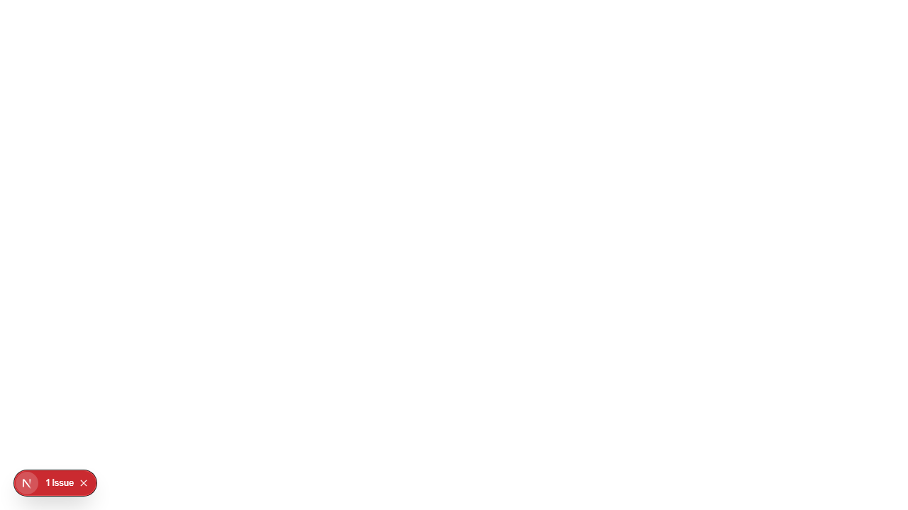

<p align="center">
  
</p>

<h1 align="center">Ninja Keyboard</h1>

<p align="center">
  A gamified Hebrew typing tutor that makes learning the keyboard fun
</p>

<p align="center">
  <a href="README.md">English</a> | <a href="README.he.md">עברית</a>
</p>

<p align="center">
  
  
  
  
  
  
  <br />
  <a href="https://github.com/eladjak/ninja-keyboard/stargazers">
    
  </a>
  <a href="https://github.com/eladjak/ninja-keyboard/blob/main/LICENSE">
    
  </a>
</p>

<p align="center">
  <a href="https://ninja-keyboard-nine.vercel.app"><strong>Live Demo</strong></a>
</p>

---

## About

Ninja Keyboard is an interactive Hebrew typing tutor designed for kids ages 6-16. Practice typing with adaptive difficulty, track your progress, and compete with others -- all wrapped in a ninja-themed experience with original characters, voice acting, and sound effects.

## Features

- **Adaptive Difficulty** -- Lessons adjust in real time based on your accuracy and speed
- **Real-Time WPM Tracking** -- Live words-per-minute and accuracy metrics as you type
- **Character System** -- Unlock ninja characters with unique personalities and voice lines
- **Boss Battles** -- Test your skills against timed typing challenges
- **Story Mode** -- Progress through a narrative while mastering the Hebrew layout
- **Sound & Music** -- Original soundtrack, SFX, and character voice acting
- **Internationalization** -- Full Hebrew and English UI via next-intl
- **Dark/Light Theme** -- System-aware theming with next-themes
- **PWA Support** -- Installable as a progressive web app
- **Accessibility** -- Keyboard navigation, screen reader support, WCAG 2.2 AA compliant

## Screenshots

| Home | Lessons | Speed Test |
|:----:|:-------:|:----------:|
|  |  |  |

| Leaderboard | Statistics | Games |
|:-----------:|:----------:|:-----:|
|  |  |  |

## Tech Stack

| Layer | Technologies |
|-------|-------------|
| Framework | Next.js 16, React 19, TypeScript |
| Styling | Tailwind CSS 4, Framer Motion, Radix UI, shadcn/ui |
| State | Zustand |
| Backend | Supabase (Auth, Database, Realtime) |
| Audio | Howler.js, Lottie animations |
| i18n | next-intl (Hebrew + English) |
| Testing | Vitest, React Testing Library, Playwright (E2E), axe-core (a11y) |
| Validation | Zod |

## Getting Started

### Prerequisites

- Node.js 18+ (or [Bun](https://bun.sh))
- A [Supabase](https://supabase.com) project (free tier works)

### Installation

```bash
git clone https://github.com/eladjak/ninja-keyboard.git
cd ninja-keyboard
npm install
```

### Configuration

```bash
cp .env.example .env.local
```

Add your Supabase credentials to `.env.local`:

```
NEXT_PUBLIC_SUPABASE_URL=your-project-url
NEXT_PUBLIC_SUPABASE_ANON_KEY=your-anon-key
```

### Run

```bash
npm run dev
```

Open [http://localhost:3000](http://localhost:3000) to start typing.

## Scripts

| Command | Description |
|---------|-------------|
| `npm run dev` | Start dev server |
| `npm run build` | Production build |
| `npm run test` | Run unit tests (Vitest) |
| `npm run test:e2e` | Run E2E tests (Playwright) |
| `npm run typecheck` | TypeScript type check |
| `npm run verify` | Typecheck + tests |

## Project Structure

```
src/
├── app/           # Next.js App Router pages
│   ├── (auth)/    # Login, register, student setup
│   └── (app)/     # Protected: home, lessons, battle, progress
├── components/    # UI components (shadcn/ui, auth, layout)
├── hooks/         # Custom React hooks
├── lib/           # Supabase client, auth utilities
├── stores/        # Zustand state management
├── styles/        # Design tokens & age-based themes
├── types/         # TypeScript type definitions
└── i18n/          # Internationalization messages
```

## Contributing

Contributions are welcome! Feel free to open issues or submit pull requests.

1. Fork the repository
2. Create your feature branch (`git checkout -b feat/amazing-feature`)
3. Commit your changes (`git commit -m 'feat: add amazing feature'`)
4. Push to the branch (`git push origin feat/amazing-feature`)
5. Open a Pull Request

## License

This project is licensed under the MIT License.

---

<p align="center">
  If you find this project useful, please consider giving it a star!
  <br />
  <a href="https://github.com/eladjak/ninja-keyboard">
    
  </a>
</p>
